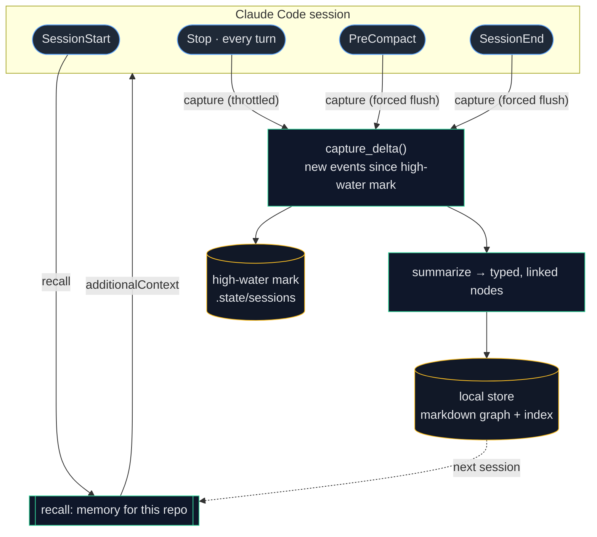

# 🧠 engram — give Claude Code a memory

**Claude Code forgets everything when a session ends. engram fixes that — privately, on your machine, and it gets sharper over time.**

engram is a Claude Code **plugin** that remembers the durable facts from each session
(decisions, gotchas, conventions) and recalls the relevant ones the moment you start
working again. It's **role-aware** (it remembers differently for an engineer vs a PM
vs a manager, learned automatically), it keeps itself sharp with **bonsai-style
pruning**, and it **self-improves** from your feedback.

**🔒 Absolute privacy by construction:** everything is stored locally on your own
laptop. No server, no account, no auth, no telemetry — **zero bytes leave your machine.**

## Install (Claude Code)
```
/plugin marketplace add prajwalppv/engram
/plugin install engram@engram
```
Restart Claude Code. That's it — on a platform with a prebuilt binary you need **nothing
else installed** (no Python, no uv). Then just work: engram recalls your repo's memory at
session start and captures as you work. Commands: `/engram:recall`,
`/engram:remember`, `/engram:howto`, `/engram:status`, `/engram:prune`, `/engram:optimize`.

> A future, opt-in, sanitized *export* could let teammates share selected learnings; it
> does not exist yet and is never automatic.

## Demo
Last sprint you fought through a prod incident, locked in some decisions, and set
conventions. Weeks later you start a new feature in a **brand-new session** —
blank-slate Claude. You ask in your own words, and engram surfaces each crucial
prior fact by *meaning*, fully on-device — including the gotcha that stops you
re-causing the incident:


```text
🧠 engram — Claude Code remembers the things that bite you

── Session 1 · last sprint · repo: checkout-service ─────────────
   ✍️  [Gotcha]      Payment webhook double-charged 1,400 customers (PROD-142)
   ✍️  [Decision]    Idempotency-Key required on every write endpoint
   ✍️  [Gotcha]      orders↔inventory deadlock under concurrent checkout
   ✍️  [Decision]    Postgres over Mongo for checkout
   ✍️  [Convention]  Money in integer cents; timestamps in UTC ISO-8601
   ✍️  [Constraint]  PCI — full card numbers never touch logs

   (session ends — normally Claude forgets every line of this)

── Session 2 · today · new feature: subscription renewals ───────
   …a brand-new session. engram recalls by MEANING, fully on-device:

   you ▸ I'll add automatic retries to the renewal payment call — anything I should know?
      ↳ [Gotcha] Payment webhook double-charged 1,400 customers (PROD-142)  ·  0.64
        “Synchronous retries on the Stripe webhook double-charged 1,400 customers on 2026-05-12. NEVER…”
        🛑 stops you re-causing the May-12 incident

   you ▸ how do we keep a write endpoint safe if the client calls it twice?
      ↳ [Decision] Idempotency-Key required on every write endpoint  ·  0.63
        “All POST/PUT take an Idempotency-Key header, stored in processed_requests to short-circuit…”

   you ▸ what's our rule for storing money amounts and timestamps?
      ↳ [Convention] Money in integer cents; timestamps in UTC ISO-8601  ·  0.78
        “Never floats for currency — store/compute in integer cents, format at the UI edge…”

   you ▸ are we allowed to log a customer's full credit-card number?
      ↳ [Constraint] PCI — full card numbers never touch logs  ·  0.67
        “Mask PAN to last-4 everywhere; full card data never enters logs, traces, or memory…”

→ Different words, surfaced by meaning. The incident, the conventions, the
  constraints — carried across sessions so they're never relearned.

🔒 Everything stayed on this machine. No server, no account, no telemetry.
```

_(The transcript above is the same run, for readers with images off.)_

Run it yourself (throwaway store, ~15s): `uv run python demo/demo.py`.
Re-record the GIF with [VHS](https://github.com/charmbracelet/vhs):
`vhs demo/engram.tape` → writes `docs/demo.gif`.

## How it works
- Memory is a **local knowledge graph** of markdown notes (wikilinks + backlinks),
  searched semantically (local embeddings, no cloud).
- A Claude Code **plugin** captures and recalls memory across the session lifecycle —
  **not just at the end**, so nothing is lost to compaction or an abrupt terminal close:
  - `SessionStart` → **recall** context relevant to your current repo/task (also after a compaction).
  - `Stop` (end of every turn) → **incremental capture**, throttled so it only distills once a few new turns accumulate.
  - `PreCompact` → **flush before compaction** — captures detail right before Claude summarizes it away.
  - `SessionEnd` → **final flush** of anything remaining.
- Every capture is **incremental and idempotent**: a per-session high-water mark means
  each trigger folds only the *new* delta into memory, and content-hash + semantic dedup
  prevent duplicates. See **[docs/ARCHITECTURE.md](docs/ARCHITECTURE.md)**.
- A **role profile** (SWE / PM / EM / …) shapes what gets extracted and recalled.
  Your role is inferred as soft weights from your sessions and is overridable.
- An **always-on layer** learns your **standing preferences** ("always use uv",
  "never force-push", "I prefer terse answers") and applies them every session —
  see below.
- A **feedback loop** (was a recalled memory used? edited? rejected?) tunes the
  role weights and the extraction/recall prompts over time.

## Preferences — the always-on layer
engram has different memory **horizons**. Most memory is *retrieved* on relevance
(decisions, gotchas, conventions). But **standing preferences** are global rules
that should apply to *every* session — so they're delivered automatically, two ways
(a deliberate hybrid):

- **Persistent:** engram maintains a managed block in your project's `CLAUDE.md`
  (only ever touching content between its own markers — your file is otherwise untouched).
- **Immediate:** they're also injected at `SessionStart`, so a freshly-learned
  preference applies right away.

It learns them **automatically** when you state a standing rule ("from now on…",
"always…", "I prefer…") — no command needed — and they're **pruning lifelines**
(never auto-removed). Review and remove them anytime with `/engram:status`
(→ `memory_forget`). One-tap undo; fully recoverable.

## Memory horizons & scope
engram models memory along two orthogonal axes — which is what keeps recall sharp
instead of a noisy everything-bucket:

**Horizon — the *kind* of memory** (each with its own capture, recall, and decay):

| Horizon | Holds | Lifetime |
|---|---|---|
| **working** | the current task's "where was I" | hours — TTL'd; injected only on **resume** |
| **episodic** | what happened (sessions, incidents) | weeks — consolidated by bonsai |
| **semantic** | durable facts (decisions, gotchas, conventions) | long — vigor-scored |
| **procedural** | runbooks / "how we do X" | long — durable, **supersede-with-history** |
| **preference** | standing rules about you | ~permanent — **lifeline**, always-on |

**Scope — *where* it applies:** `global → role → area → repo → session`. Recall is
applicability-filtered, so one repo's conventions never leak into another, and a
preference can be global ("always use uv") or repo-specific. Precedence is
**most-specific-wins**, and a memory can `supersede` ones it replaces. Working
scratch decays in a day; preferences effectively never — pruning is horizon-aware.

Procedural runbooks are auto-captured when you spell out a process with steps (or
save one with `/engram:howto`); working memory needs no setup.

## Architecture
Memory is captured at multiple points in the session lifecycle and recalled at the
start of the next one — all on-device. ([full diagrams + component view →](docs/ARCHITECTURE.md))



## Status
Working, single-user, local-only — with a real memory model:
- **Multi-horizon memory** — working · episodic · semantic · procedural · preference,
  each with its own capture, recall, and decay (see *Memory horizons & scope*).
- **Always-on preferences** — learned standing rules, delivered every session
  (hybrid: a managed `CLAUDE.md` block + `SessionStart` injection).
- **Scope ladder + precedence** (`global → role → area → repo → session`) so memory
  applies where it should and a specific rule overrides a general one.
- **Semantic recall on by default** (local embeddings); automatic text fallback.
- **Durable multi-trigger capture** (Stop / PreCompact / SessionEnd) — survives
  compaction and abrupt exits.
- **One stable store** at `~/.engram/store`, shared across every editor/host, with
  safe auto-migration on update.

## Requirements
- [uv](https://docs.astral.sh/uv/) for the full **semantic** experience. On first
  run, the plugin pulls fastembed + a small embedding model (~160 MB once, from
  PyPI + HuggingFace), then runs fully offline. Nothing is committed to the repo.
- **No uv? Still works.** The plugin falls back to a committed self-contained
  binary (~16 MB on macOS arm64, ~36 MB on Linux x86_64) that gives fast **text**
  recall with zero setup.

Either way, everything stays on your machine.

### Self-contained binary (the no-uv text fallback)
The plugin runs via `scripts/engram-launch`, which prefers `uv` (semantic) and
falls back to the bundled binary (text). Build the binary per platform (ideally CI):
```bash
bash scripts/build_binary.sh      # → bin/<os>_<arch>/engram (~16–36 MB, PyInstaller)
```
It's lean by design — the heavy embedding deps are pulled on demand via uv, never
bundled or committed.

## Install as a Claude Code plugin (the few-click path)
From the public marketplace repo (or any git repo, e.g. a private one for a team):
```
/plugin marketplace add prajwalppv/engram
/plugin install engram@engram
```
Or from this local checkout, to try it now:
```
/plugin marketplace add /Users/vibestar/dev/engram
/plugin install engram@engram
```
Then restart Claude Code. The plugin:
- spawns the local `engram-mcp` server (stdio) over a single, stable per-user
  store at `~/.engram/store` (shared across every editor/host, so your memory is
  never fragmented);
- adds lifecycle hooks that recall memory at **SessionStart** and capture it
  incrementally at **Stop** / **PreCompact** / **SessionEnd** (durable across
  compaction and abrupt exits);
- adds commands: `/engram:recall`, `/engram:remember`, `/engram:status`.

**Zero-click for a shared repo:** commit a `.claude/settings.json` with
`extraKnownMarketplaces` + `enabledPlugins` so teammates get it on clone+trust.

## Staying up to date (auto-updates)
You shouldn't have to babysit updates. How updates reach you:
- **Installed from the community marketplace** (`engram@claude-community`): updates
  are **automatic** — Anthropic-managed marketplaces have auto-update on by default,
  so new releases land silently at startup (you'll get a `/reload-plugins` nudge).
- **Installed from this repo** (`engram@engram`): third-party marketplaces default
  to *manual* updates. Turn auto-update on once via `/plugin` → **Marketplaces** →
  engram → **Enable auto-update** (or `claude plugin update engram` when you like).
- **For a team:** drop this in your repo's `.claude/settings.json` and everyone
  gets engram **auto-installed and auto-updated** on clone + trust — no manual steps
  (see [`examples/team-settings.json`](examples/team-settings.json)):
  ```json
  {
    "extraKnownMarketplaces": {
      "engram": { "source": { "source": "github", "repo": "prajwalppv/engram" }, "autoUpdate": true }
    },
    "enabledPlugins": { "engram@engram": true }
  }
  ```
Updates are safe across the store-path change: on first run a new version
**auto-migrates** any legacy store into `~/.engram/store` (copy-only, never
destructive), so an update never appears to lose your memory.

## Semantic recall (default)
Semantic recall is **on by default** — local embeddings via fastembed (ONNX, no
PyTorch). The deps come from PyPI and the model from HuggingFace, **pulled once on
first use** (~160 MB), then it's fully offline. No cloud, no API. To force plain
keyword recall instead, set `ENGRAM_SEARCH_BACKEND=text`.

## Dev
```bash
uv sync --extra dev
uv run pytest -q
```

## Configuration (env, prefix `ENGRAM_`)
| Var | Default | Meaning |
|-----|---------|---------|
| `ENGRAM_STORE_DIR` | `~/.engram/store` | Local memory store. |
| `ENGRAM_SEARCH_BACKEND` | `semantic` | `semantic` (local embeddings) or `text`. |
| `ENGRAM_ROLE` | `auto` | Pin a role (`swe`/`pm`/`em`) or infer. |
| `ENGRAM_EMBEDDING_MODEL` | `BAAI/bge-small-en-v1.5` | fastembed model. |
| `ENGRAM_CAPTURE_ON_STOP` | `true` | Incremental end-of-turn (`Stop`) capture. Set `false` to capture only at PreCompact/SessionEnd. |
| `ENGRAM_CAPTURE_EVERY_TURNS` | `13` | Min new user turns before a `Stop` capture fires (lower = more durable + more frequent distillation; higher = less overhead). PreCompact/SessionEnd flush the remainder regardless. |
| `ENGRAM_DETECT_PREFERENCES` | `true` | Auto-learn standing preferences from your sessions. |
| `ENGRAM_MANAGE_CLAUDE_MD` | `true` | Maintain engram's managed preferences block in `CLAUDE.md`. |
| `ENGRAM_CLAUDE_MD_PATH` | project `./CLAUDE.md` | Where the managed block is written (set to `~/.claude/CLAUDE.md` for truly global). |
| `ENGRAM_DETECT_PROCEDURES` | `true` | Auto-capture runbooks (procedural memory) from spelled-out step lists. |
| `ENGRAM_WORKING_MEMORY` | `true` | Track per-session "where was I" and inject it on resume. |
| `ENGRAM_WORKING_TTL_HOURS` | `18` | Resume window for working memory; older snapshots are pruned. |
| `ENGRAM_AREA` | (unset) | Optional cross-repo domain (e.g. `python`) for the scope ladder. |

## Design seams
- `core/` — vendor-neutral, no MCP imports.
- `roles/` — the Profile seam applied to *people*; discoverable via the
  `engram.roles` entry-point group.
- `core/search_backends.py` — lazy `Semantic` (fastembed, **default**) + `Text` fallback.
- `core/scoping.py` + the `horizon` field — the memory-model seam (**horizon × scope**),
  so new horizons or scope levels drop in without touching the core.
- A dormant `visibility`/`export` seam (separate from the live `scope` ladder) so
  future opt-in team sharing is a flip, not a rewrite.
