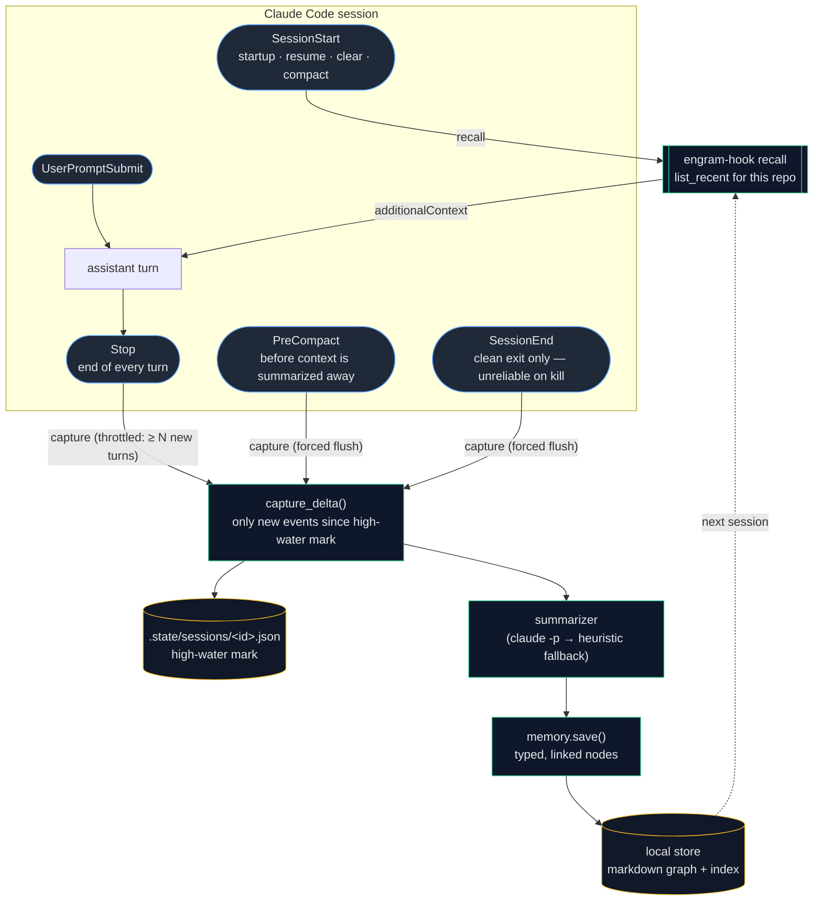
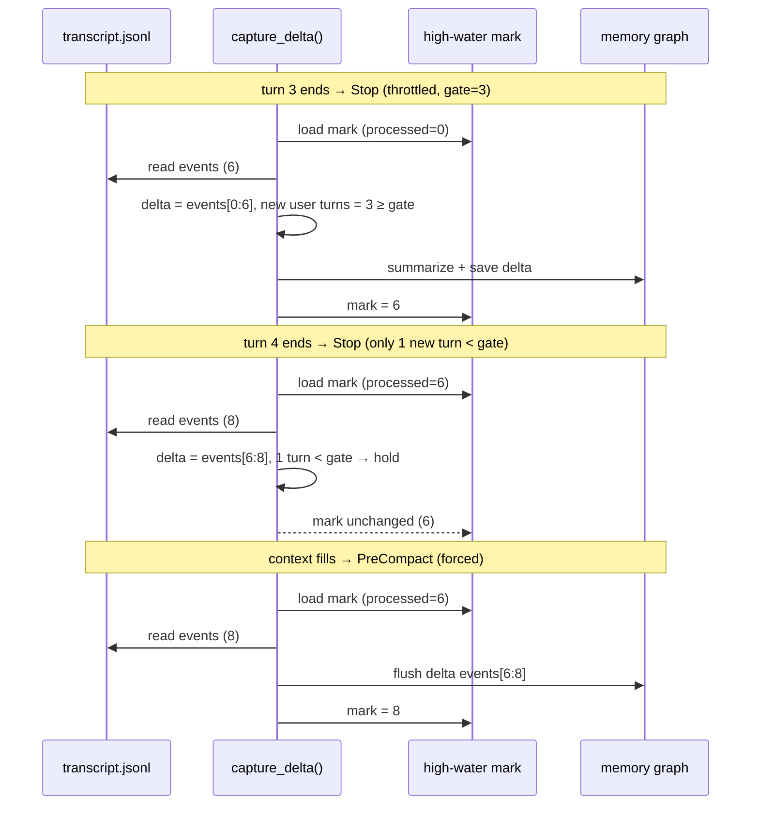
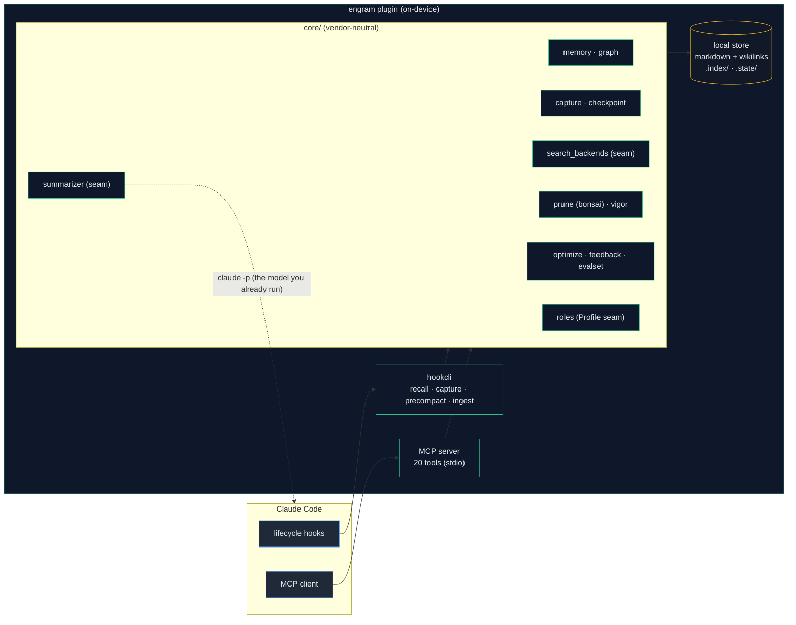

# engram — architecture

engram is a Claude Code **plugin** with two halves: a set of **lifecycle hooks**
that capture and recall memory automatically, and a local **MCP server** that
exposes memory as tools. Both talk to the same vendor-neutral **core**, which
reads and writes a **local knowledge graph** of markdown notes. Nothing leaves
the machine.

---

## 1. Capture & recall lifecycle

Memory is captured at **multiple points** in a session — not just at the end —
so nothing is lost if context is compacted or the terminal is closed abruptly.
Every capture is **incremental and idempotent**: a per-session high-water mark
means each trigger only folds the *new* delta into memory.

**Why multiple triggers?** `SessionEnd` alone is fragile — it does not reliably
fire when the terminal window is closed, the process is killed, or the OS shuts
down. So engram also captures:

| Trigger | When | Mode | Purpose |
|---|---|---|---|
| `Stop` | end of every assistant turn | throttled (≥ `capture_every_turns` new turns), async | steady incremental capture; durable even if you never exit cleanly |
| `PreCompact` | right before auto/manual compaction | forced flush | **lossless across compaction** — the main silent-loss event in long sessions |
| `SessionEnd` | clean exit (`/exit`, Ctrl-D, `/clear`, logout) | forced flush | final flush of the remaining delta |
| `SessionStart` | start / resume / clear / **compact** | — | recall memory back into context (incl. *after* a compaction) |

---

## 2. The high-water mark (incremental, idempotent)

All three capture triggers funnel through `capture_delta()`, which reads the live
transcript, skips everything already captured, and processes only the new tail.
This is what makes it safe to fire often and from overlapping events.

Downstream, `memory.save()` also applies **content-hash** and **semantic** dedup,
so even if the same delta is processed twice (e.g. a `--resume` re-reads an old
transcript), it is merged, never duplicated.

---

## 3. Components & data flow

Two adapters (hooks + MCP) over one core over one local store. The core has **no**
MCP or vendor imports — every external concern is a swappable seam.

**Privacy boundary:** the only thing that ever leaves the plugin is a local
`claude -p` call for summarization — the same model binary the developer already
runs. Memory itself (markdown, index, state) is plain files on the local disk.
There is no network/server/auth code in engram at all.

### Swappable seams
| Seam | Default | Swap to |
|---|---|---|
| `search_backends` | semantic (fastembed/ONNX, local) | text (zero-dep) |
| `summarizer` | `claude -p` (LLM) | heuristic (no-LLM) |
| roles (`Profile`) | swe / pm / em / generic | any via the `engram.roles` entry-point |
| storage | local filesystem | the `StorageBackend` protocol |

---

## 4. Self-improvement loop
Captured memory is not static. A feedback signal (was a recalled memory used,
edited, or rejected?) tunes the inferred role weights and the extraction prompt,
while **bonsai pruning** consolidates stale notes and self-tunes its own
aggressiveness from a measured *resurrection rate*. See [PRUNING.md](PRUNING.md).
